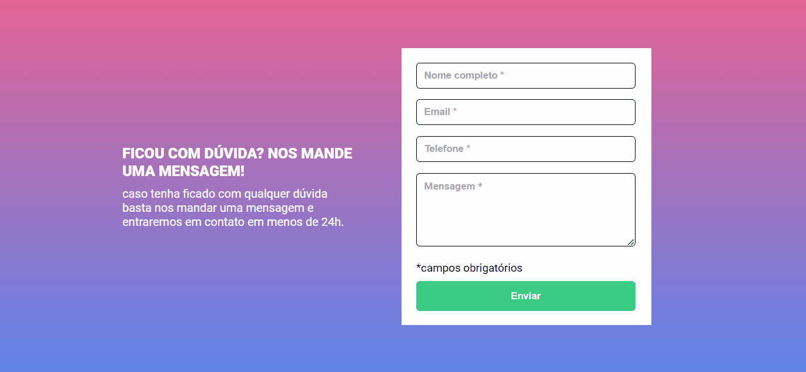
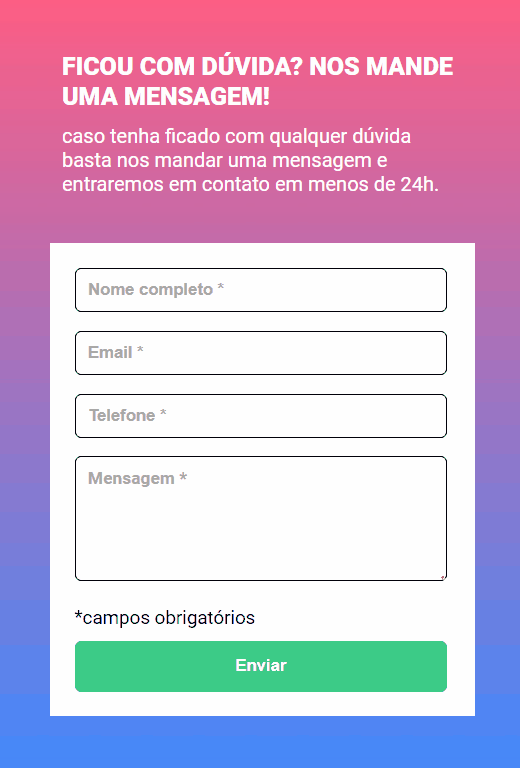

# DevQuest | Formulário 

Essa página é um formulário com validação. Ao clicar para enviar o formulário, caso algum campo não esteja preenchido, a borda do input ficará vermelha e uma mensagem 'campo obrigatório' será exibida abaixo do campo que não foi preenchido. Ao preencher o campo, a borda do input ficará verde.

Este formulario é um exercício do curso DevQuest, que será enviado para correção. O objetivo deste exercício é por em pratica tudo o que aprendi no módulo de JavaScript intermediario e reforçar meus conhecimentos em HTML e CSS.

## Índice

- Design
- Links
- Tecnologias utilizadas

## Visão geral

### Design desktop 🖥️

### Design mobile 📱

## Links

- [Formulário](https://erickf-silva.github.io/formulario/)

## Tecnologias utilizadas

- HTML
- CSS
- JS
